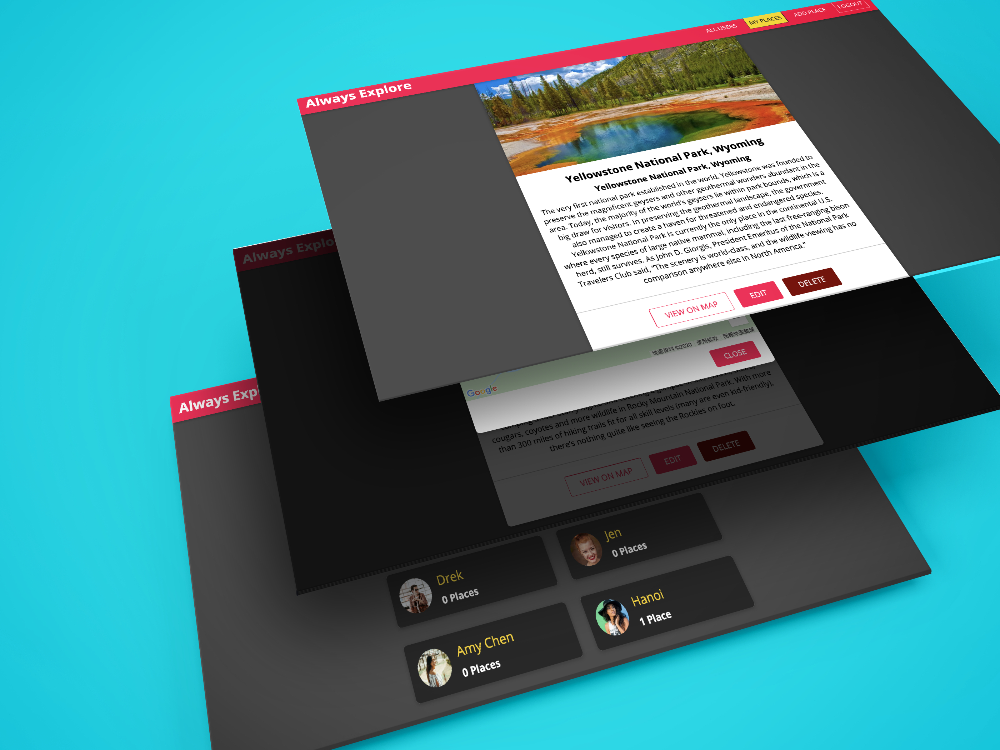

# Always Expore-MERN
<h1 align="center">
🌐 MERN Stack
</h1>
<p align="center">
MongoDB, Expressjs, React/Redux, Nodejs
</p>

<p align="center">
    
</p>


> MERN is a fullstack implementation in MongoDB, Expressjs, React/Redux, Nodejs.

MERN stack is the idea of using Javascript/Node for fullstack web development.

## Clone or download
```terminal
$ git clone https://github.com/kuanghsuan/Always-Explore-MERN.git
$ cd Always-Explore-MERN
$ npm install
```

## Project Structure
```terminal
/Always-Explore-MERN
  frontend/
     package.json
     .env (to create .env, check [prepare your secret session])
  backend/
     nodemon.json
     package.json
  README.md
```

# Usage (run fullstack app on your machine)

## Prerequirements
- [MongoDB](https://gist.github.com/nrollr/9f523ae17ecdbb50311980503409aeb3)
- [Node](https://nodejs.org/en/download/)
- [npm](https://nodejs.org/en/download/package-manager/)
- [express](https://expressjs.com/en/guide/routing.html/)

notice, you need client and server runs concurrently in different terminal session, in order to make them talk to each other

## Frontend usage (PORT: 3000)
```terminal
$ cd frontend   // go to client folder
$ npm i       // npm install pacakges
$ npm start // run it locally

// deployment for client app
$ npm run build // this will compile the react code using webpack and generate a folder called docs in the root level
$ npm run start // this will run the files in docs, this behavior is exactly the same how gh-pages will run your static site
```

## Backend usage (PORT: 5000)
```terminal
$ cd backend   // go to backend folder
$ npm install       // npm install pacakges
$ npm start // run it locally
```

## Deploy backend to [Heroku](https://dashboard.heroku.com/)
```terminal
$ brew tap heroku/brew && brew install heroku //install the heroku cli
$ cd backend // got to the backend folder
$ git init
$ heroku login // then enter your heroku password 
...
$ heroku git:clone -a always-explore
$ cd always-explore
$ git add .
$ git commit -am "make it better"
$ git push heroku master
```

## Deploy frontend to [Firebase](https://firebase.google.com/docs/hosting/deploying)
```terminal
$ curl -sL https://firebase.tools | bash       // install the firebase cli
$ cd frontend     // go to the frontend folder
$ firebase init
...
$ firebase deploy
```


